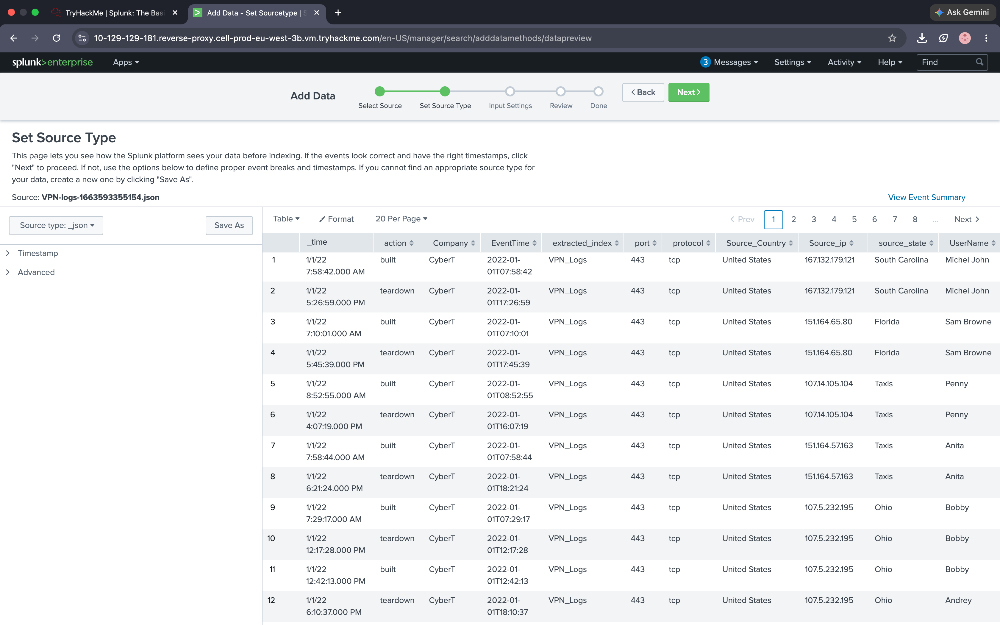
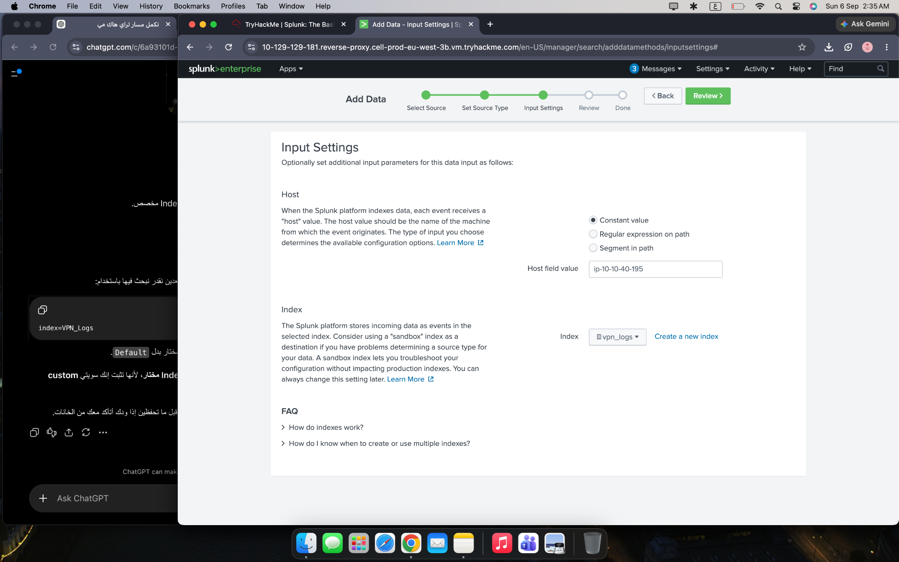
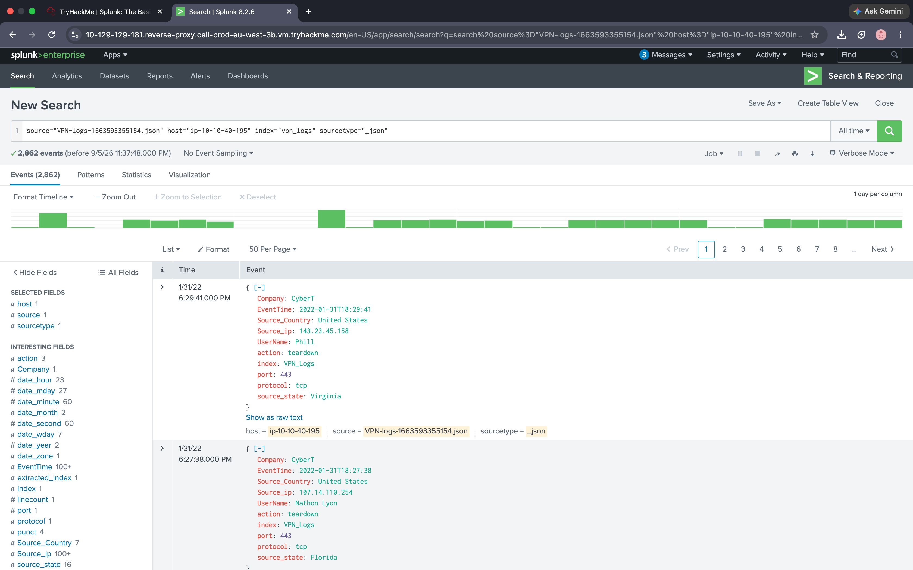
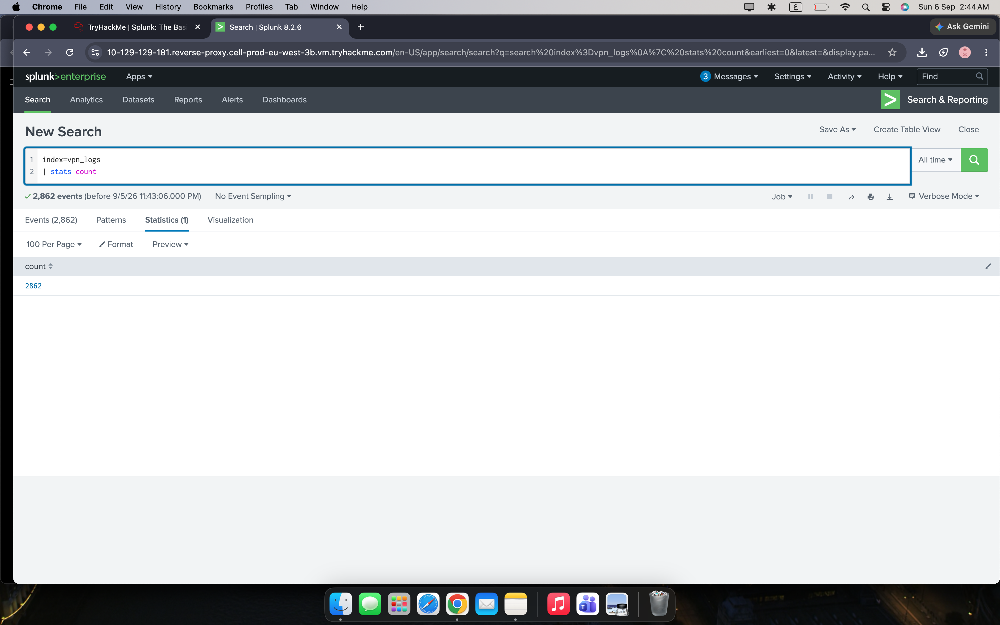
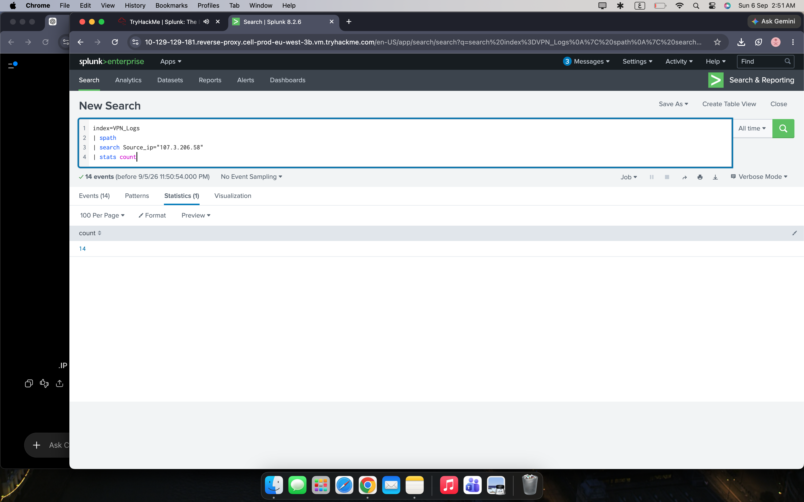
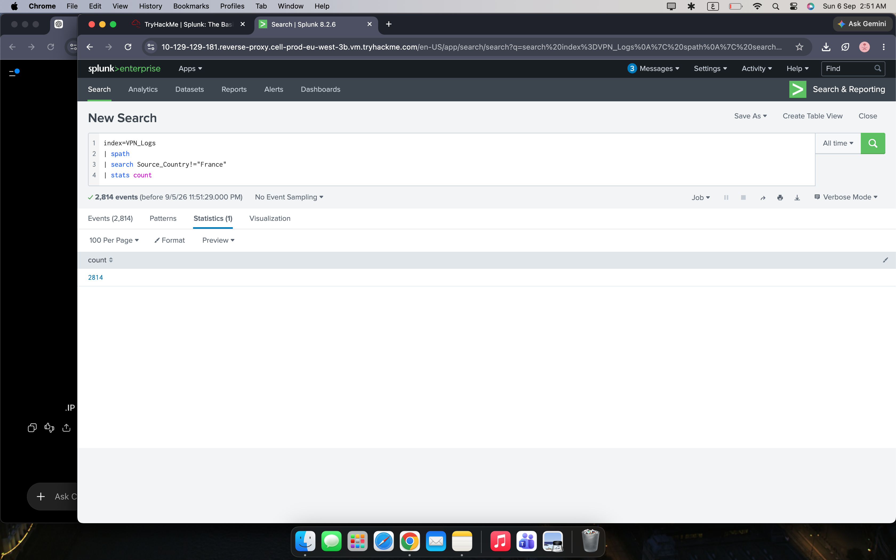

# Splunk VPN Log Analysis

Hands-on Splunk lab focused on VPN log ingestion, SPL queries, and basic SIEM analysis.

## Objective

The goal of this lab was to practice ingesting VPN log data into Splunk and using SPL to search, filter, and analyze security events.

## Lab Environment

- Splunk Enterprise
- VPN logs in JSON format
- TryHackMe lab environment

## What I Practiced

- Ingesting JSON log data into Splunk
- Creating a dedicated index for VPN logs
- Working with parsed fields such as username, source IP, and country
- Searching indexed events using SPL
- Filtering events by user, IP address, and country
- Associating a source IP with a username
- Counting and summarizing VPN events

## Data Ingestion

The VPN log file was uploaded into Splunk as JSON data.

Splunk parsed the raw JSON into searchable fields such as:

- `UserName`
- `Source_ip`
- `Source_Country`
- `action`
- `port`
- `protocol`



A dedicated index named `vpn_logs` was created to store the VPN events.



The log file was then successfully uploaded and made available for analysis.



## SPL Analysis

### Total VPN Events

```spl
index=vpn_logs
| stats count
```

This query searches the VPN index and counts all available events.

**Result:** 2,862 events.



### Identify a User Associated with a Source IP

```spl
index=vpn_logs
| search Source_ip="107.14.182.38"
| stats values(UserName) as UserName count
```

This query filters VPN events by source IP and identifies the associated username.

**Result:** The IP was associated with the user `Smith`.


### Count Events from a Specific Source IP

```spl
index=vpn_logs
| spath
| search Source_ip="107.3.206.58"
| stats count
```

This query filters VPN events for a specific source IP and counts the matching events.

**Result:** 14 events.



### Exclude Events from France

```spl
index=vpn_logs
| spath
| search Source_Country!="France"
| stats count
```

The `!=` operator excludes events where the source country is France.

**Result:** 2,814 events originated from countries other than France.



## Key Takeaways

This lab helped reinforce the basic Splunk workflow:

**Log Data → Ingestion → Indexing → SPL Search → Filtering → Analysis**

I practiced using VPN log fields such as usernames, source IP addresses, and source countries to search and analyze events in Splunk.

## Skills Practiced

`Splunk` `SIEM` `SPL` `Log Analysis` `Log Ingestion` `VPN Logs` `SOC`
